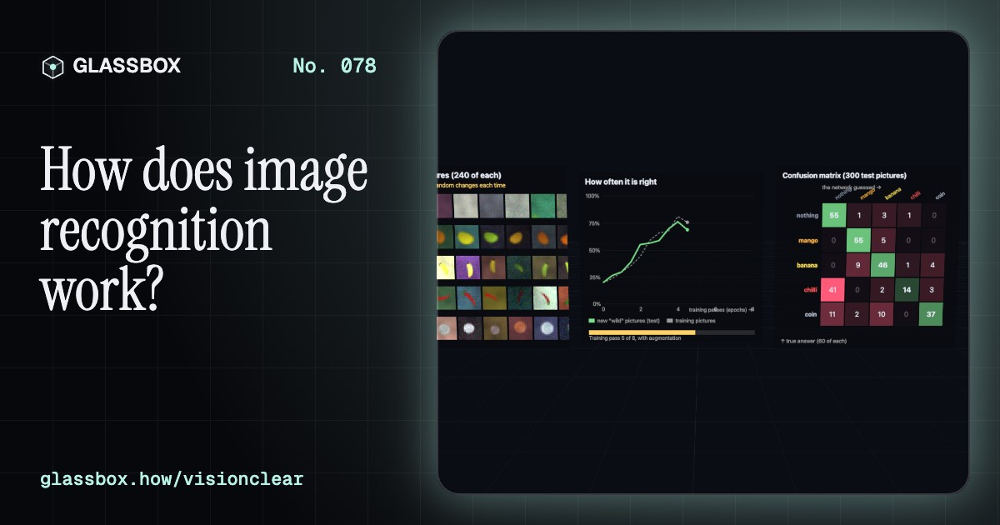
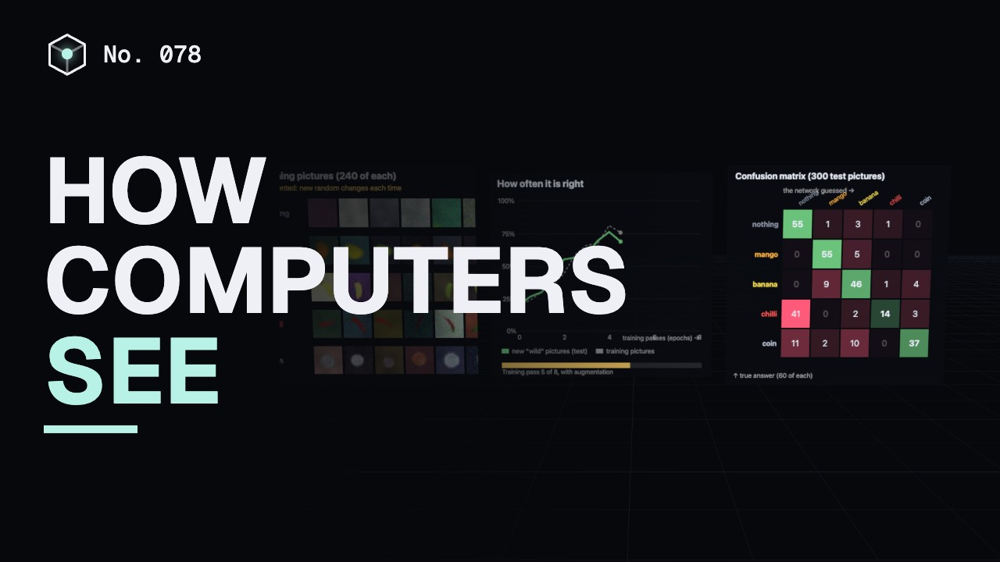
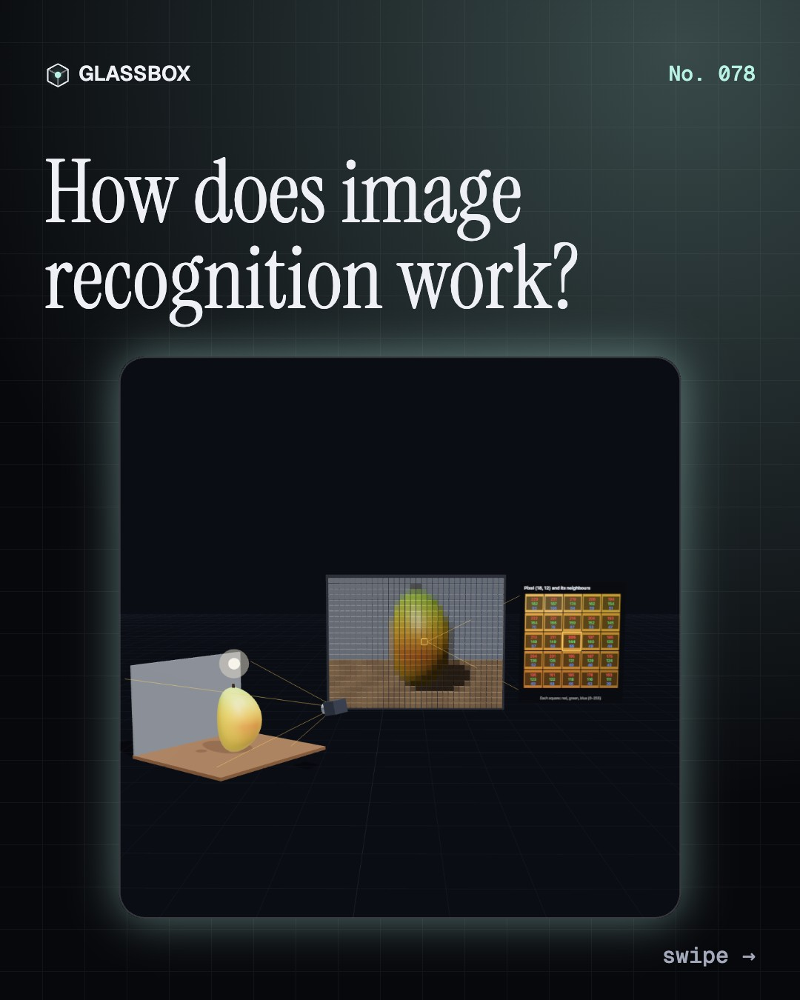
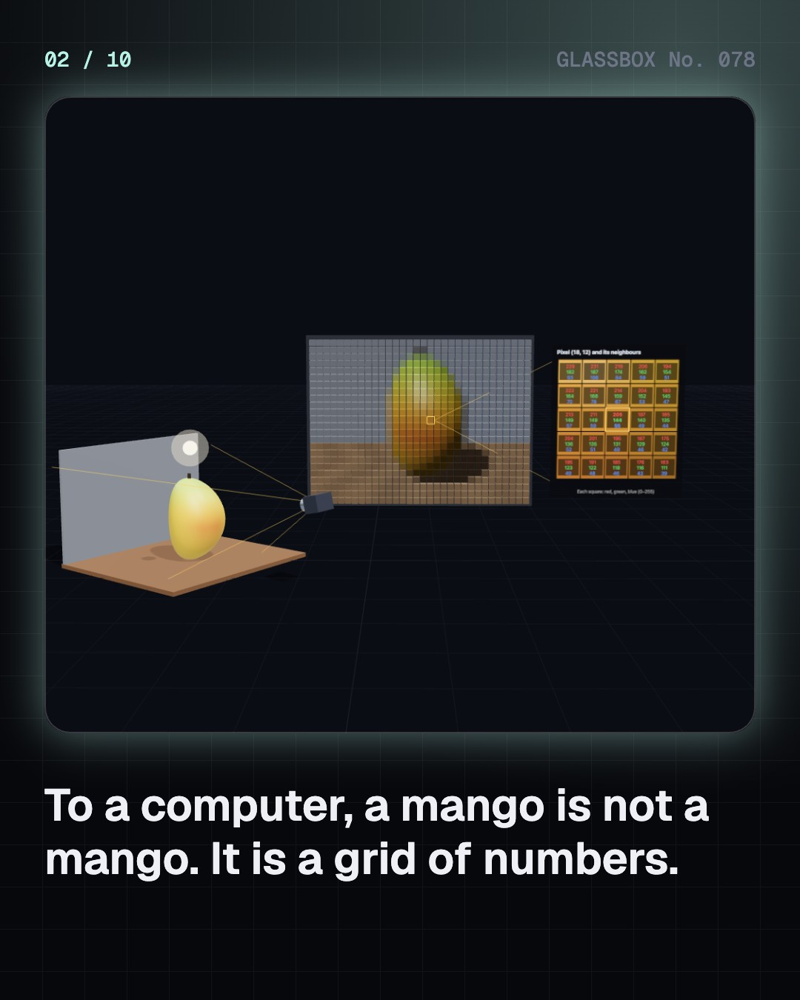
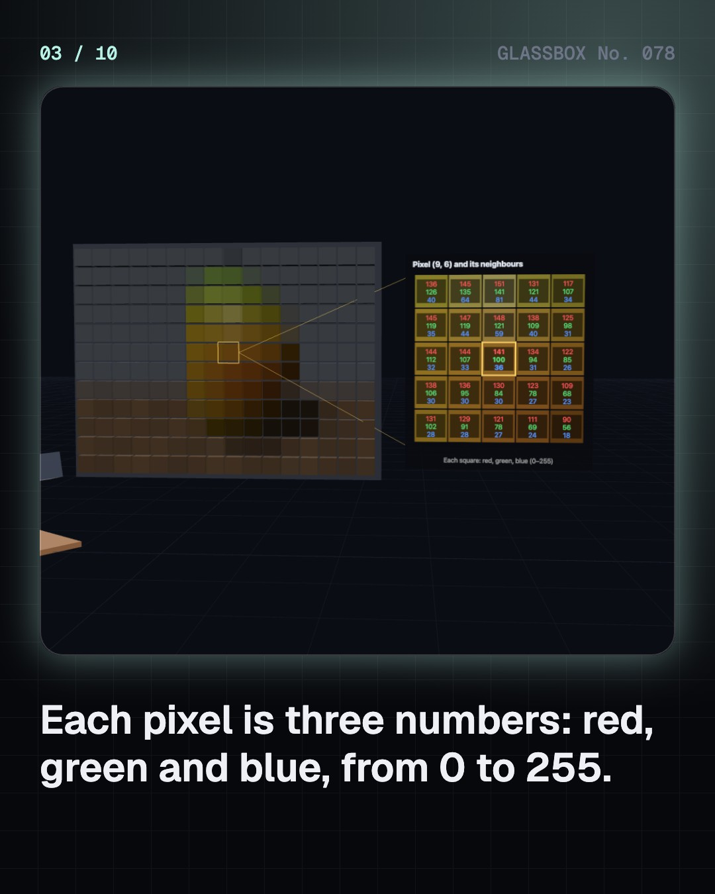
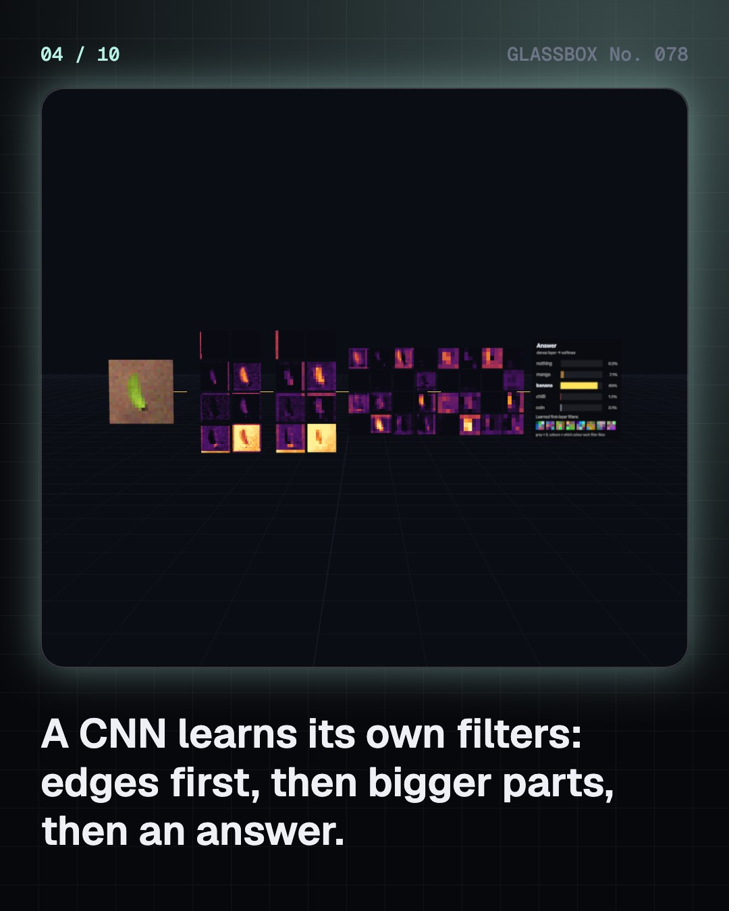

<!-- glassbox:start -->
<!-- Generated from glassbox.json by the Glassbox hub (npm run readme -- visionclear). Edit glassbox.json, not this block. -->
<p align="center"><a href="https://glassbox-production-fd52.up.railway.app/e/visionclear/"></a></p>

<h1 align="center">VisionClear</h1>

<p align="center"><b>How does image recognition work?</b><br>To a computer, a mango is 2,304 numbers. Here a tiny camera renders one, hand-made filters find its edges, and a real neural network learns to tell mangoes from bananas, chillies and coins right in your browser. Then it finds them in a scene, draws boxes and masks, and gets fooled by invisible noise.</p>

<p align="center"><a href="https://glassbox-production-fd52.up.railway.app/visionclear/"><b>▶ Play with it</b></a> &nbsp;·&nbsp; <a href="https://glassbox-production-fd52.up.railway.app/e/visionclear/">Read the 60-second explainer</a> &nbsp;·&nbsp; <a href="https://glassbox-production-fd52.up.railway.app/visionclear/glassbox/reel.mp4">Watch the 40-second video</a></p>

<p align="center">
  <a href="https://glassbox-production-fd52.up.railway.app/e/visionclear/"></a>
  <a href="https://glassbox-production-fd52.up.railway.app/e/visionclear/"></a>
  <a href="LICENSE"></a>
  <a href="LICENSE-CONTENT.md"></a>
  <a href="#privacy"></a>
</p>

## In 60 seconds

1. **A picture is only numbers.** A camera sensor turns light into a grid of pixels, each with a red, green and blue value from 0 to 255. A 32 × 24 picture is 2,304 numbers. Turn the object, move the camera or change the light and most of those numbers change, though it is the same mango. Recognising means finding what stays the same.
2. **Filters find edges, layers find parts.** A 3 × 3 grid of weights slid over the picture, a convolution, lights up where brightness jumps: edges. Edges two ways at once are corners; busy patterns are texture. Max pooling keeps the biggest number in each 2 × 2 block. A CNN stacks learned filters, so early layers find edges and colours and later layers combine them into parts.
3. **Learning from labelled pictures.** A small CNN with 21,081 weights trains in your browser on 1,200 made-up pictures of a mango, banana, chilli, coin or nothing, and is tested on 300 wild ones it never saw. Data augmentation, randomly turning, flipping and re-lighting each picture, stops it from memorising and lifts test accuracy. A confusion matrix shows what it mixes up.
4. **Where, not just what.** Slide the recogniser over 897 windows of a scene and keep the confident ones. Non-max suppression keeps the best box and deletes duplicates that overlap it, measured by IoU, overlap divided by union. A second small network labels every pixel, turning boxes into masks. Detectors like YOLO do it in one pass, fast enough for video.
5. **It fails in strange ways.** A tiny change to every pixel, worked out from the network's own gradient, can flip its answer. A network trained with every fruit on its own background learns the background instead. Dim light outside its training range lowers accuracy. The 2018 Gender Shades study found face-analysis errors of up to 34.7% for darker-skinned women against at most 0.8% for lighter-skinned men.
6. **Everywhere, with limits.** Image recognition searches photos, helps screen for diabetic eye disease in India, suggests crop diseases, reads number plates and checks factory parts. Reading a UPI QR code mostly uses classic geometry with no learning. Vision transformers and vision-language models are next, but they can be confidently wrong, and face recognition raises real privacy questions.

## Words worth knowing

| Term | Meaning |
|---|---|
| **Pixel** | One tiny square of a picture, stored as red, green and blue numbers. |
| **Convolution** | Sliding a small grid of weights over a picture and adding up at every spot. |
| **Feature map** | The picture of a filter's answers: bright where it found its pattern. |
| **Max pooling** | Keeping the biggest number in each small block, which shrinks a map and tolerates small shifts. |
| **CNN** | A convolutional neural network: layers of learned filters and pooling, then an answer. |
| **Data augmentation** | Randomly turning, flipping, re-lighting and adding noise to training pictures so a network can't memorise them. |
| **IoU** | Intersection over union: how much two boxes overlap, from 0 to 1. |
| **Non-max suppression** | Keeping the most confident box and deleting the boxes that overlap it too much. |
| **Adversarial example** | A picture changed on purpose, often invisibly, so that a model gets it wrong. |

## A short history

**About 70 years from the first digital photo to machines that look and talk.**

- **1957** · The first digital photo (Russell Kirsch and colleagues, National Bureau of Standards, Washington DC, United States)
- **1959** · Cells that answer to edges (David Hubel and Torsten Wiesel, Johns Hopkins University, Baltimore, United States)
- **1966** · Vision as a summer project (Seymour Papert and students, MIT Artificial Intelligence Group, Cambridge, United States)
- **1980** · The Neocognitron (Kunihiko Fukushima, NHK Broadcasting Science Research Laboratories, Tokyo, Japan)
- **1989** · A network reads zip codes (Yann LeCun and colleagues, AT&T Bell Labs, Holmdel, United States)
- **2001** · Real-time face detection (Paul Viola and Michael Jones, Mitsubishi Electric Research Labs and Compaq, Cambridge, United States)
- **2009** · ImageNet (Fei-Fei Li, Jia Deng and colleagues, Princeton University, United States)
- **2012** · AlexNet (Alex Krizhevsky, Ilya Sutskever and Geoffrey Hinton, University of Toronto, Canada)

The full story, with 30 moments, charts, people and 64 sources: [glassbox.how/e/visionclear/history](https://glassbox-production-fd52.up.railway.app/e/visionclear/history/). The data lives in [`history.json`](history.json).

## Video and slides

Made with the Glassbox studio from this box's storyboard (`window.glassbox.director`). Free to reuse under CC BY 4.0.

<a href="https://glassbox-production-fd52.up.railway.app/visionclear/glassbox/video.mp4"></a>

<p><a href="glassbox/slide-1.jpg"></a> <a href="glassbox/slide-2.jpg"></a> <a href="glassbox/slide-3.jpg"></a> <a href="glassbox/slide-4.jpg"></a></p>

| File | What | Size |
|---|---|---|
| [`glassbox/reel.mp4`](https://glassbox-production-fd52.up.railway.app/visionclear/glassbox/reel.mp4) | Reel / Short, with captions and soundtrack | 1080×1920 |
| [`glassbox/video.mp4`](https://glassbox-production-fd52.up.railway.app/visionclear/glassbox/video.mp4) | YouTube video, with captions and soundtrack | 1920×1080 |
| `glassbox/slide-1…10.jpg` | Instagram carousel | 1080×1350 |
| `glassbox/thumb.jpg` | YouTube thumbnail | 1280×720 |
| `glassbox/cover.jpg` | Share card and repo social preview | 1200×630 |
| [`glassbox/history-reel.mp4`](https://glassbox-production-fd52.up.railway.app/visionclear/glassbox/history-reel.mp4) | “History in 10 moments” Reel / Short | 1080×1920 |
| `glassbox/history-slide-*.jpg` | History carousel | 1080×1350 |
| `glassbox/post.json` | Post copy and schedule used by the publish kit | |

## Privacy

This box has no accounts and no ads, and it ships its own fonts and libraries. When you run it yourself it sends nothing anywhere. On glassbox.how, the site's `/bar.js` also loads Glassbox's analytics: **Google Analytics** to count visits (it asks first in the EU, UK and Switzerland, and stays off when your browser sends Global Privacy Control or Do Not Track) and **ClickTrust** to detect bots.

It remembers a few things **in your own browser only**, and never sends them anywhere:

| Browser storage key | What it holds |
|---|---|
| `visionclear.v1` | Which chapters you have opened, your best quiz scores, and sound on or off. |

Exactly what each one sees is at [glassbox.how/privacy](https://glassbox-production-fd52.up.railway.app/privacy/).

## Licences

- **Code:** [MIT](LICENSE). Use it, change it, ship it.
- **Explanations, text, images and videos** (`glassbox.json`, `glassbox/`): [CC BY 4.0](LICENSE-CONTENT.md). Credit “Glassbox, glassbox.how/e/visionclear”.
- **Third-party parts** keep their own licences: [three.js](https://threejs.org) (MIT), [Geist, Instrument Serif](https://openfontlicense.org) (SIL OFL 1.1).
- The Glassbox name and logo aren't covered by either licence. See the [terms](https://glassbox-production-fd52.up.railway.app/terms/).

Found a mistake? [Open an issue](https://github.com/bdeeps/visionclear/issues). Corrections happen in public.
<!-- glassbox:end -->

## Run it

It's plain HTML, CSS and JavaScript. No build step and no dependencies. Run locally, it contacts no other website.

```bash
python3 -m http.server 8000
```

Three.js and the fonts ship in `vendor/` and `fonts/`, so it also works offline.

Then open http://localhost:8000.

## How it's built

| File | What |
|---|---|
| `index.html`, `css/app.css` | The page and its styles |
| `js/app.js`, `js/stage.js`, `js/ui.js`, `js/kit.js` | The shared Glassbox 3D engine: chapters, 3D stage, controls, quiz, video director |
| `js/chapters/*.js` | One file per chapter: the 3D model, controls, text, key terms, quiz and video scenes |
| `js/vision.js` | The vision maths, written from scratch: a ray-marching renderer for the 3D mango, the made-up picture maker, Sobel, Harris and Laws filters, a small CNN with backpropagation and Adam, augmentation, the adversarial attack, IoU, non-max suppression and a QR finder-pattern scan (no three.js, runs in Node too) |
| `js/lab.js` | Makes the training pictures and trains the three networks (recogniser, mask network, shortcut network) in the browser, a few milliseconds at a time |
| `js/visview.js` | Pictures as 3D pixel walls, and the canvas boards: charts, probability bars, feature maps |
| `glassbox.json` | Title, question, explainer beats, key terms, browser storage and credits shown on glassbox.how |
| `reel` in each chapter | The storyboard the Glassbox studio records into short videos |
| `glassbox/` | The published video, slides, thumbnail and post copy |
| `fonts/`, `vendor/three/` | Self-hosted Geist and Instrument Serif (SIL OFL 1.1) and three.js (MIT) |
